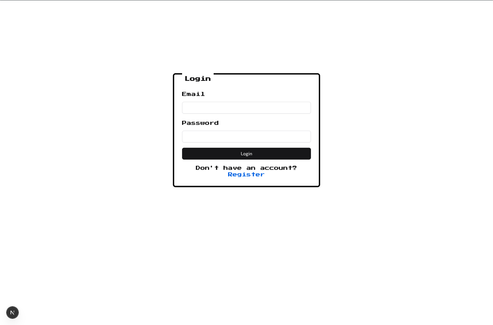
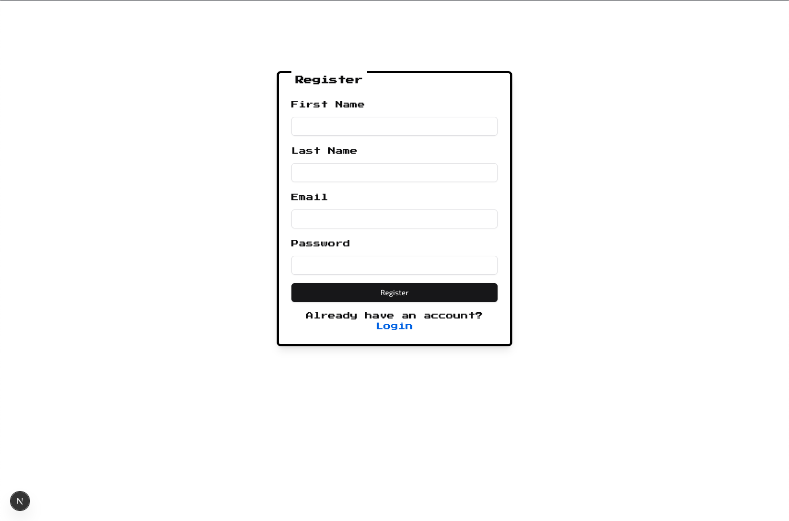
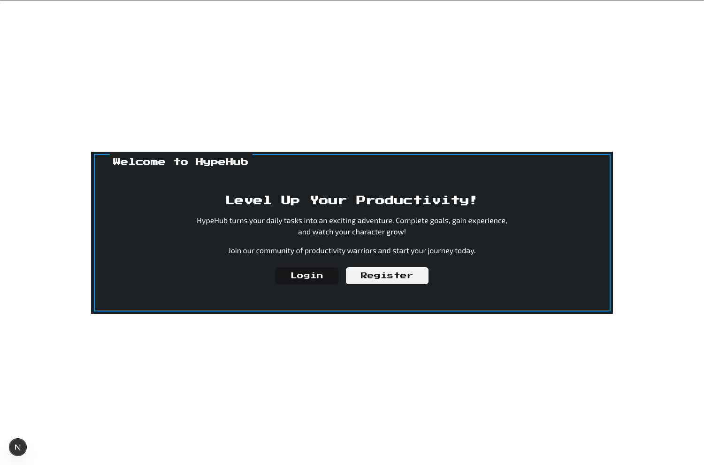
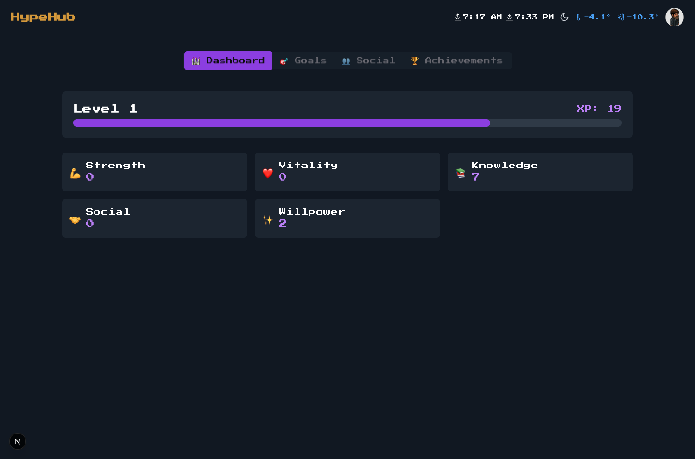
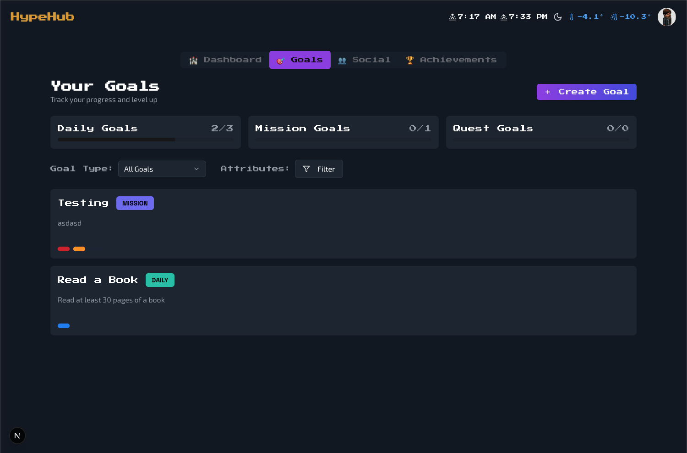
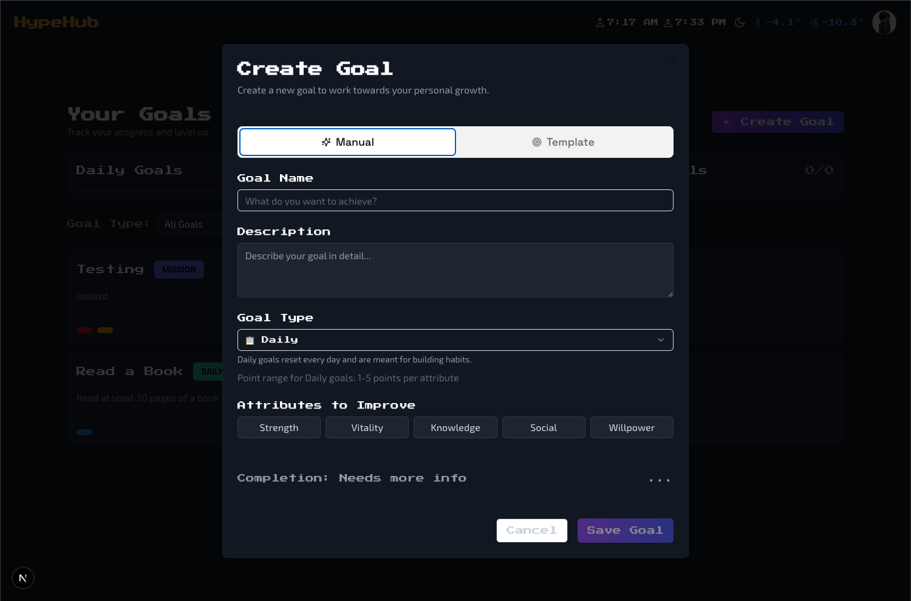
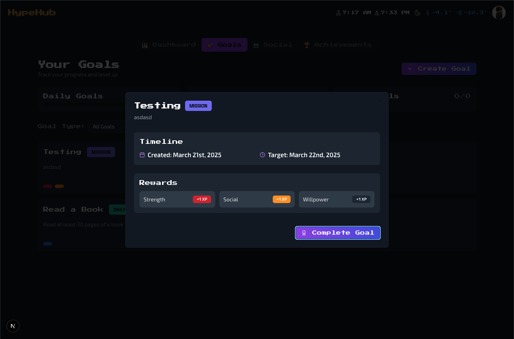
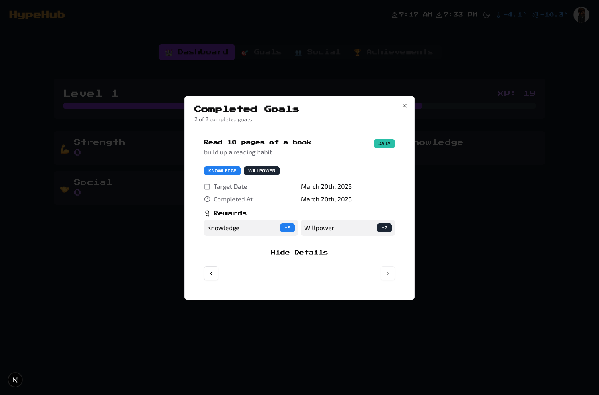

# HypeHub

HypeHub is a gamified productivity application built with Next.js that turns your daily tasks into an exciting adventure. Complete goals, gain experience, and watch your character grow!

## Features

- **Gamified Task Management**: Transform your daily tasks into an RPG-style adventure
- **Character Progression**: Level up your character through five core attributes:
  - **Strength**: Master physical challenges and tasks requiring endurance
    - Perfect for exercise goals, sports activities, and physical projects
    - Example: "Complete 30 minutes of weight training" (+3 STR)
  - **Vitality**: Boost your health and wellness stats
    - Ideal for health goals, sleep schedule, and maintaining good habits
    - Example: "Maintain a consistent sleep schedule" (+2 VIT)
  - **Knowledge**: Increase your wisdom and learning power
    - Great for study goals, learning new skills, and intellectual pursuits
    - Example: "Complete a programming tutorial" (+4 KNW)
  - **Social**: Enhance your charisma and networking abilities
    - Perfect for networking goals, social events, and communication tasks
    - Example: "Attend a community meetup" (+3 SOC)
  - **Willpower**: Strengthen your mental fortitude and discipline
    - Ideal for breaking bad habits, meditation, and challenging personal goals
    - Example: "Meditate for 15 minutes" (+2 WIL)
- **Multiple Goal Types**:
  - **Daily**: Quick quests that reset daily (1-5 attribute points)
    - Perfect for building habits and maintaining daily routines
  - **Missions**: Medium-term challenges (5-15 attribute points)
    - Ideal for projects and medium-scope achievements
  - **Quests**: Epic long-term adventures (15-50 attribute points)
    - Perfect for life-changing goals and major achievements
- **Progression Systems**:
  - **Level System**: Progress through levels with tiered XP rewards, level-up celebrations, and visual progress tracking
  - **Attribute System**: Each completed goal awards attribute points based on type and difficulty
  - **Goal History**: View completed goals by attribute with detailed rewards and completion dates
- **Profile Features**:
  - **Profile Avatars**: Custom profile pictures with fallback initials
- **External Integrations**:
  - **Weather Integration**: Real-time weather data with temperature tracking and forecasts
- **Real-time Features**: 
  - Server status indicator
  - Connected users count
  - Real-time notifications
  - Goal completion celebrations

## Screenshots


*Login Page with retro-styled interface*


*Registration Page with retro-styled interface*


*Welcome screen with character stats and active goals*


*Dashboard showing character progression and attributes*


*Goals list with filtering and sorting options*


*Goal Creation Form with attribute rewards*


*Detailed view of a goal with progress tracking*


*Completed goals view with attribute-based filtering*

## Tech Stack

- **Runtime**: Node.js 20.x
- **Package Manager**: pnpm 10.x
- **Framework**: Next.js 15.x with TypeScript
- **Styling**: Tailwind CSS, NES.css for retro styling
- **Database**: Supabase with PostgreSQL
- **Authentication**: Supabase Auth
- **ORM**: Drizzle
- **Real-time**: WebSocket server with ws package
- **Infrastructure**: 
  - Terraform for cloud infrastructure
  - Ansible for configuration management
  - PM2 for process management

## Project Structure

This is a monorepo containing:
- `client/`: Next.js frontend application
- `server/`: WebSocket server for real-time features
- `packages/types`: Shared TypeScript types
- `infrastructure/`: Infrastructure as Code (IaC)
  - `terraform/`: GCP infrastructure configuration
  - `ansible/`: Deployment and configuration management

## Infrastructure

HypeHub uses Infrastructure as Code (IaC) to automate deployment and management of the WebSocket server.

### Cloud Infrastructure (Terraform)
- GCP e2-micro instance for WebSocket server
- Configured firewall rules for:
  - SSH (22)
  - HTTP (80)
  - HTTPS (443)
  - WebSocket (8080)
- Automated VM provisioning and configuration

### Deployment (Ansible)
- Automated server setup and configuration
- Node.js and pnpm installation
- PM2 process management
- GitHub deploy key configuration
- Application deployment and updates

## Quick Start

### Prerequisites
- Node.js 20.x
- pnpm 10.x
- Google Cloud Platform account (for production)
- Supabase account and project

### Local Development
1. Clone the repository
2. Install dependencies:
```bash
pnpm install
```
3. Set up environment variables:
```env
# Client (.env in client/)
NEXT_PUBLIC_SUPABASE_URL=your_supabase_url
NEXT_PUBLIC_SUPABASE_ANON_KEY=your_supabase_anon_key
NEXT_PUBLIC_WEBSOCKET_URL=your_websocket_url
DATABASE_URL=your_database_url
DATABASE_SESSION_POOL_URL=your_session_pool_url
NEXT_PUBLIC_SUPABASE_BUCKET_NAME=your_bucket_name

# Server (.env in server/)
PORT=8080
ALLOWED_ORIGINS=http://localhost:3000
```
4. Start the development servers:
```bash
# Start WebSocket server
pnpm --filter server dev

# Start Next.js client
pnpm --filter client dev
```
5. Open [http://localhost:3000](http://localhost:3000) in your browser

### Production Deployment

1. **Infrastructure Setup**
```bash
# Initialize and apply Terraform configuration
cd infrastructure/terraform
terraform init
terraform apply

# Deploy application with Ansible
cd ../ansible
ansible-playbook -i inventory/hosts.yml playbook.yml
```

2. **Application Updates**
```bash
# Update application
cd infrastructure/ansible
./update.sh
```

## Development

### Available Commands
```bash
# Local Development
pnpm dev              # Start both client and server

# Client commands
cd client
pnpm dev              # Start Next.js development server
pnpm build            # Build client for production
pnpm start            # Start production client
pnpm lint             # Run linting
pnpm typecheck        # Run type checking
pnpm db:gen           # Generate database types
pnpm db:push          # Push database changes
pnpm db:studio        # Open database studio

# Server commands
cd server
pnpm dev              # Start WebSocket development server
pnpm build            # Build server for production
pnpm start            # Start production server

# Infrastructure commands
cd infrastructure/terraform
terraform init        # Initialize Terraform
terraform plan        # Preview changes
terraform apply       # Apply infrastructure changes

cd infrastructure/ansible
./update.sh           # Update application
```

## Roadmap

### Infrastructure Enhancements
- SSL/TLS integration
- Automated backups
- Monitoring and alerting
- High availability setup

### Dashboard Enhancements
- Enhanced progress visualization and attribute tracking
- Flexible goal filtering (daily, weekly, monthly views)
- Smart dashboard widgets:
  - Weather integration (✅ Basic implementation)
  - News feed
  - Upcoming goals preview
- Improved animations and visual feedback

### Social Features
- Real-time chat system
- Social interactions and notifications
- User profiles and achievements
- Community challenges and events

### Smart Goal Features
- AI-powered goal suggestions
- Dynamic timeframe recommendations:
  - Missions: 1-4 weeks
  - Quests: 1-12 months
- Weather-aware outdoor goals:
  - Location-based weather checks (✅ Basic weather data)
  - Indoor alternatives suggestions
  - Weather alerts and planning

### Application Features
- Enhanced progress bars
- Settings customization
- Notifications system
- Mobile responsiveness
- Offline support

## Contributing

Contributions are welcome! Please feel free to submit a Pull Request.

## License

MIT License - Copyright (c) 2025 HypeHub

See [MIT License](https://opensource.org/licenses/MIT) for details.
